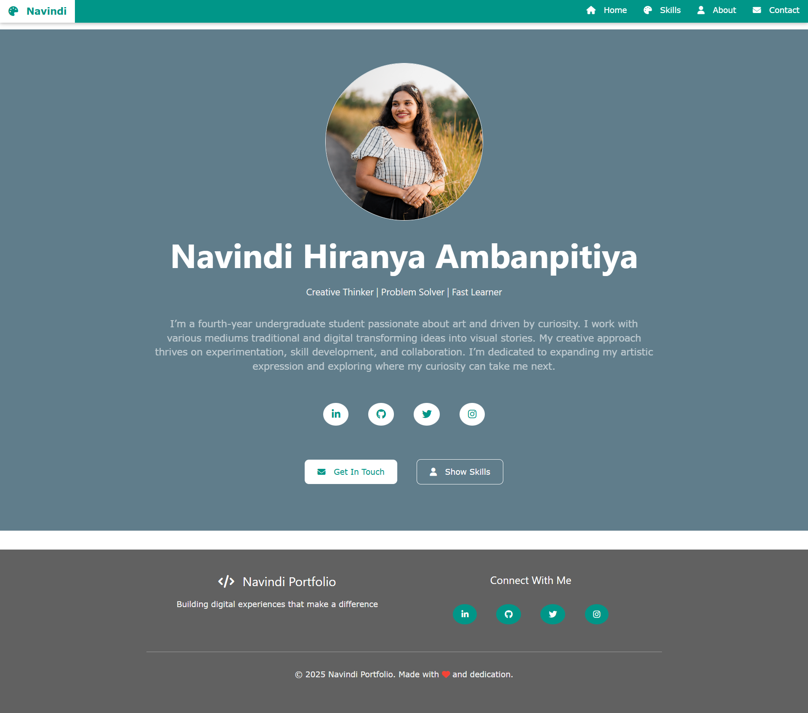

# Navindi Hiranya Ambanpitiya - Personal Portfolio

A modern, responsive personal portfolio website showcasing my creative journey as an artist and creative thinker. Built with clean HTML and styled using the W3.CSS framework for a professional and accessible web presence.

## 🎨 About This Project

This portfolio website serves as a digital showcase of my artistic journey, skills, and background. As a fourth-year undergraduate student passionate about art, I created this platform to share my creative work and connect with like-minded individuals in the artistic community.

## ✨ Features

- **Responsive Design**: Fully responsive layout that works seamlessly across desktop, tablet, and mobile devices
- **Modern Navigation**: Clean navigation bar with mobile-friendly hamburger menu
- **Professional Layout**: Well-structured sections showcasing different aspects of my profile
- **Interactive Elements**: Hover effects and smooth transitions for enhanced user experience
- **Social Media Integration**: Quick access to social media profiles and contact information
- **Optimized Images**: Properly sized and optimized images for fast loading

## 📁 Project Structure

```
navindi-about-me/
├── home.html          # Landing page with introduction and hero section
├── about.html         # Detailed personal and academic background
├── skills.html        # Showcase of artistic and technical skills
├── contact.html       # Contact information and social media links
├── readme.md          # Project documentation
└── images/
    ├── home_cover.PNG      # Profile picture for homepage
    ├── about.JPG           # Personal photo for about section
    ├── about_acdamic.JPG   # Academic background image
    └── skill_cover.JPG     # Skills section header image
```

## 🚀 Getting Started

### Prerequisites
- A modern web browser (Chrome, Firefox, Safari, Edge)
- Basic knowledge of HTML/CSS (for customization)

### Installation & Setup

1. **Clone the repository**
   ```bash
   git clone https://github.com/Nimesh-Kavinda/navindi-about-me.git
   cd navindi-about-me
   ```

2. **Open locally**
   - Simply open `home.html` in your preferred web browser
   - Or use a local server for development:
   ```bash
   # Using Python 3
   python -m http.server 8000
   
   # Using Node.js (if you have live-server installed)
   npx live-server
   ```

3. **Access the website**
   - Direct file access: Open `home.html` in browser
   - Local server: Navigate to `http://localhost:8000`

## 🛠️ Technologies Used

- **HTML5**: Semantic markup and structure
- **W3.CSS Framework**: For responsive styling and layout
- **Font Awesome**: Icon library for visual elements
- **CSS3**: Custom styling and animations
- **JavaScript**: Interactive navigation and user experience

## 📱 Pages Overview

### 🏠 Home (`home.html`)
- Hero section with profile image
- Personal introduction and tagline
- Quick access to social media profiles
- Professional summary

### 👤 About (`about.html`)
- Detailed personal background
- Academic journey and achievements
- Personal interests and philosophy
- Career aspirations

### 🎨 Skills (`skills.html`)
- Artistic skills and mediums
- Technical proficiencies
- Creative tools and software
- Skill level indicators

### 📧 Contact (`contact.html`)
- Contact form for inquiries
- Social media links
- Professional contact information
- Location and availability

## 📸 Screenshots

<!-- Add your project screenshots here -->
> **Note**: Add screenshots of your website here to showcase the different pages and responsive design.

### Desktop View

*Homepage on desktop - clean and professional layout*


## 🎯 Future Enhancements

- [ ] Add a portfolio gallery section
- [ ] Implement contact form backend functionality
- [ ] Add blog section for creative insights
- [ ] Include testimonials and recommendations
- [ ] Add animations and micro-interactions
- [ ] Implement dark/light theme toggle
- [ ] Add multi-language support

## 🤝 Contributing

While this is a personal portfolio, I welcome suggestions and feedback! If you have ideas for improvements:

1. Fork the repository
2. Create a feature branch (`git checkout -b feature/improvement`)
3. Commit your changes (`git commit -am 'Add some improvement'`)
4. Push to the branch (`git push origin feature/improvement`)
5. Open a Pull Request

## 📄 License

This project is licensed under the MIT License - see the [LICENSE](LICENSE) file for details.

⭐ If you found this portfolio inspiring, please consider giving it a star! Your support means a lot to me as I continue my creative journey.

*"I'm a fourth-year undergraduate student passionate about art and driven by curiosity. I work with various mediums traditional and digital transforming ideas into visual stories."*